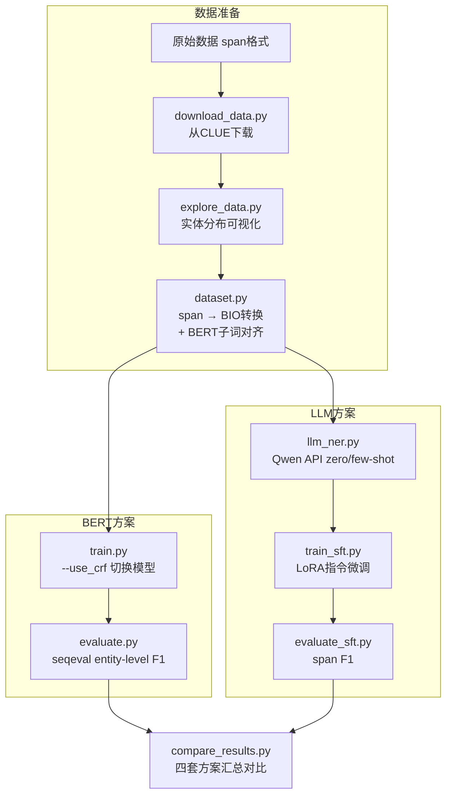
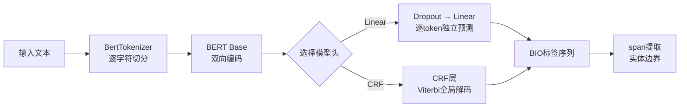
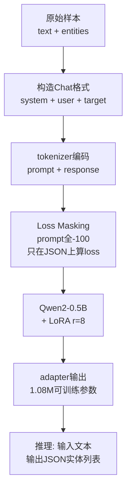

# 整体流水线架构

## 主流程图

```mermaid
flowchart TB
    subgraph 数据准备
        A[原始数据 span格式] --> B[download_data.py<br/>从CLUE下载]
        B --> C[explore_data.py<br/>实体分布可视化]
        C --> D[dataset.py<br/>span → BIO转换<br/>+ BERT子词对齐]
    end

    subgraph BERT方案
        D --> E[train.py<br/>--use_crf 切换模型]
        E --> F[evaluate.py<br/>seqeval entity-level F1]
    end

    subgraph LLM方案
        D --> G[llm_ner.py<br/>Qwen API zero/few-shot]
        G --> H[train_sft.py<br/>LoRA指令微调]
        H --> I[evaluate_sft.py<br/>span F1]
    end

    F --> J[compare_results.py<br/>四套方案汇总对比]
    I --> J
```

## BERT 方案流水线

```mermaid
flowchart LR
    A[输入文本] --> B[BertTokenizer<br/>逐字符切分]
    B --> C[BERT Base<br/>双向编码]
    C --> D{选择模型头}
    D -->|Linear| E[Dropout → Linear<br/>逐token独立预测]
    D -->|CRF| F[CRF层<br/>Viterbi全局解码]
    E --> G[BIO标签序列]
    F --> G
    G --> H[span提取<br/>实体边界]
```

## LLM SFT 微调流水线

```mermaid
flowchart TB
    A[原始样本<br/>text + entities] --> B[构造Chat格式<br/>system + user + target]
    B --> C[tokenizer编码<br/>prompt + response]
    C --> D[Loss Masking<br/>prompt全-100<br/>只在JSON上算loss]
    D --> E[Qwen2-0.5B<br/>+ LoRA r=8]
    E --> F[adapter输出<br/>1.08M可训练参数]
    F --> G[推理: 输入文本<br/>输出JSON实体列表]
```
