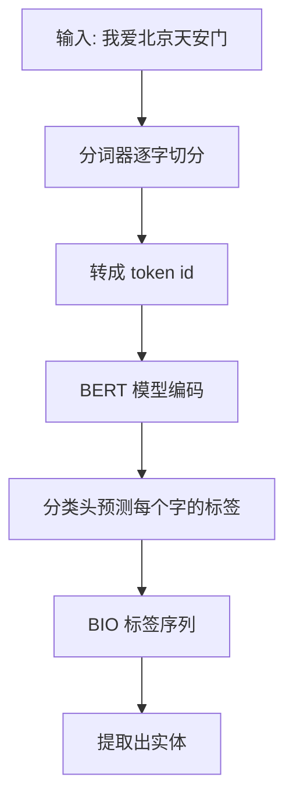

# BERT 做 NER 的完整流程

## 流程图



## 核心代码（带注释）

```python
# 定义模型：BERT + 线性分类头
class BertNER(nn.Module):
    def __init__(self, num_labels):
        super().__init__()
        # 加载预训练的中文 BERT
        self.bert = BertModel.from_pretrained('bert-base-chinese')
        # Dropout 防止过拟合
        self.dropout = nn.Dropout(0.1)
        # 线性层：把 768 维向量映射到标签数量
        self.classifier = nn.Linear(768, num_labels)

    def forward(self, input_ids, attention_mask):
        # BERT 前向传播，拿到每个字的编码
        outputs = self.bert(input_ids, attention_mask=attention_mask)
        sequence_output = outputs.last_hidden_state

        # Dropout + 分类
        sequence_output = self.dropout(sequence_output)
        logits = self.classifier(sequence_output)

        return logits  # 返回每个字的预测分数
```

## 关键参数解释

| 参数 | 值 | 作用 |
|------|-----|------|
| hidden_size | 768 | BERT 输出向量的维度 |
| num_labels | 21 | BIO 标签总数（10类实体 × 2 + O） |
| dropout | 0.1 | 随机丢弃 10% 的神经元，防止过拟合 |

## 今天踩的坑

- ❌ 忘了给子词标签设 -100，导致 loss 算错
- ✅ 用 `word_ids()` 对齐后就好了

---

> 💡 小总结：BERT 做 NER 就是「逐字打标签」，每个字判断它是哪类实体的开头/中间/外部。
